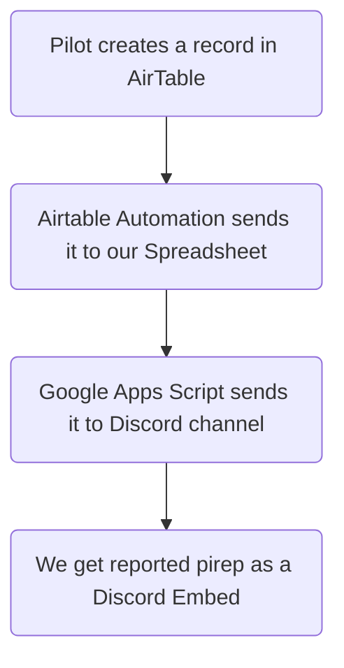

# INVA PiReps System
 
 
 
This entire ecosystem is built on the need to integrate AirTable with discord. Whenever pilots report by AirTable form, an embedded message is sent to discord. This was the most efficient way to do the task that is, by discord webhooks so there is no need of creating and _hosting_ a discord bot.

This is achieved by following algorithm :-

Aglorithm Image

## Appendix

- Introduction
- Understanding the Working
- References
- Contact me!

## Understanding the working
This script is designed to trigger when a new row is added to a Google Sheets spreadsheet. It sends the data from the new row to a Discord channel using a Discord Webhook.

Here's how the code works:

The function **onNewRowAdded** is the main entry point that is triggered when a new row is added to the spreadsheet.

The **discordWebhookUrl** variable should be replaced with your actual Discord Webhook URL.

The `sheet` variable retrieves the active spreadsheet.

The `range` variable defines the range of cells to monitor for new rows `(A2:F1001)`.

The `startRow` and `endRow` variables store the _first and last row numbers_ within the range.

The code checks if the new row falls within the specified range by comparing the row and column indices of the `e.range` parameter.

If the new row is within the range, the code proceeds to extract the data from the row.

The headers variable retrieves the header values from the first row of the spreadsheet.

The values variable retrieves the values from the new row.

The code then constructs an **embed object** with a title, color, and an empty array of fields.

It loops through each header and corresponding value, creating a field for each non-empty value. Each field consists of a name _(header)_ and value _(corresponding value)_.

The created fields are added to the embed object.

Finally, the options object is prepared for making a **POST** request to the Discord webhook URL, including the JSON-encoded embed object as the payload.

The **UrlFetchApp.fetch()** function is called with the Discord webhook URL and options to send the POST request, effectively sending the data to the Discord channel.

  
References

[^1]: [Cannot find active sheet: TypeError: read properties of undefined (reading 'source')](https://webapps.stackexchange.com/questions/169822/cannot-find-active-sheet-typeerror-read-properties-of-undefined-reading-sour)

[^2]: [Google Apps Script Documentation](https://developers.google.com/apps-script)

[^3]: [Spreadsheet Service](https://developers.google.com/apps-script/reference/spreadsheet) ` covers the Spreadsheet Service in Google Apps Script, which provides methods for working with Google Sheets.`

[^4]: [UrlFetchApp](https://developers.google.com/apps-script/reference/url-fetch/url-fetch-app) ` allows making HTTP requests from a script, including sending POST requests to webhooks.`

[^5]: (Discord Webhooks Documentation](https://discord.com/developers/docs/resources/webhook)

Contact Me!

[gmail](mailto:tred38434@gmail.com)

